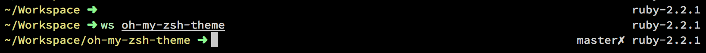

# Oh my, it's a theme!

Contains my ruby/git-friendly prompt and a ``ws`` project folder switcher.



## Install

```
git clone ...
cd into it
cp chrpes.zsh-theme ~/.oh-my-zsh/themes/
cp -R plugin ~/.oh-my-zsh/custom/plugins/chrpes
```

Enable the theme in ``~/.zshrc``:

```
ZSH_THEME="chrpes"
[...]
plugins=([...] chrpes)
```
